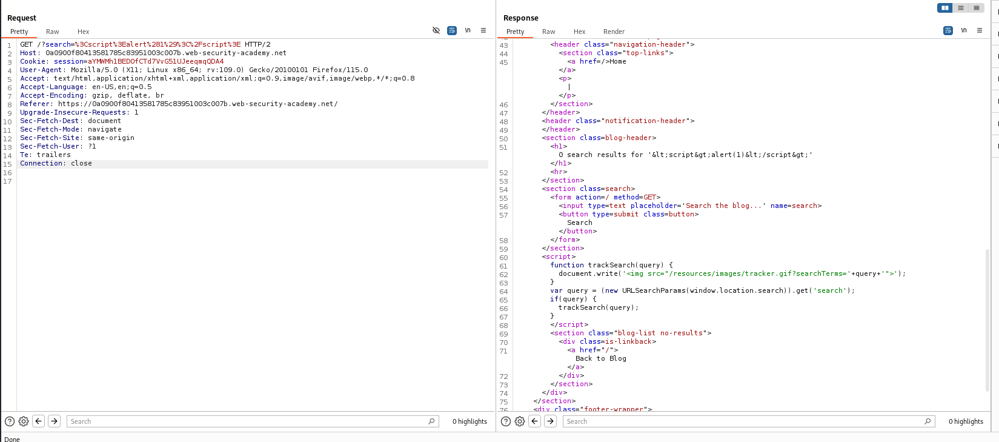
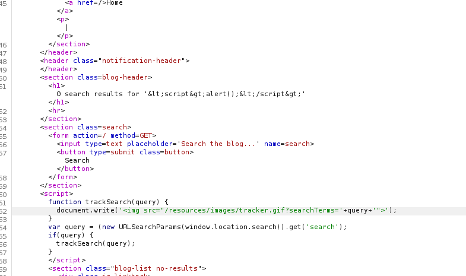

## Overview:
This is a simple lab to demonstrate the concept of DOM cross-site Scripting.
Target audience: apprentice

## Description:

This lab contains a DOM-based cross-site scripting vulnerability in the search query tracking functionality. It uses the JavaScript document.write function, which writes data out to the page. The document.write function is called with data from location.search, which you can control using the website URL.

To solve this lab, perform a cross-site scripting attack that calls the alert function. 
Availability of the Lab:
	the lab is made by the portswigger academy. you can access it through this link:
	https://portswigger.net/web-security/cross-site-scripting/dom-based/lab-document-write-sink

## Methodology:
This lab is simple doesn't need any methodology. It is specific to a single vulnerability. 

## Execution: 
First the search box is tested with the simple payload `""` and is intercepted with burp suite proxy.
Then the intercepted request is sent to the Repeater.

The payload didn't return the desired response but while examining the response the following javascript code is discovered:

This script exposes a potential information that the `document.write()` function uses the location.search property of the window object which means that testing directly from the web page is much better because it will also include testing the window object!

Another discovery is that actually the query is handled as a part of an image source of an image tag!

These two observations conclude to the generation of the following payload:

`"> `
The search element is directly tested from the web page with the mentioned payload. 
As a result the alert box pop-up!
