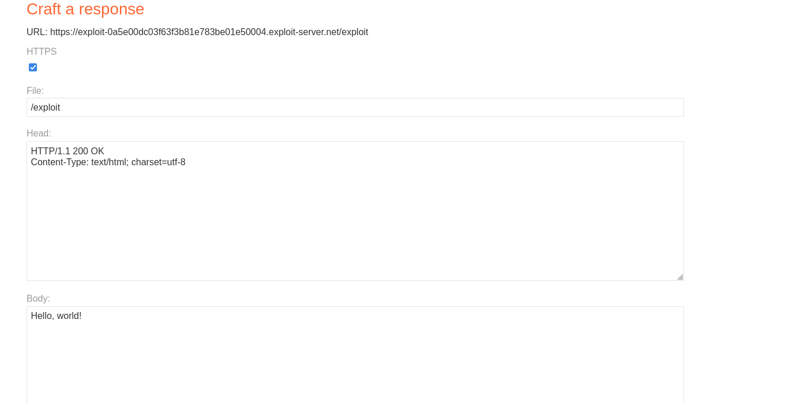
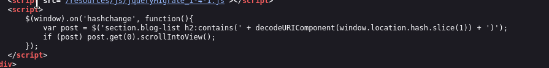
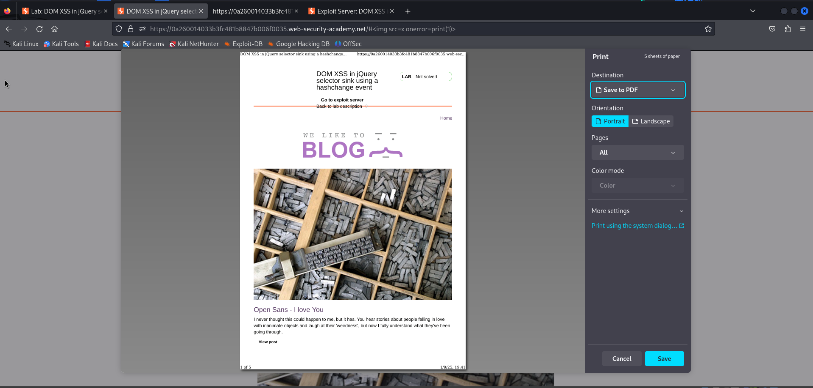

## Overview:
This is a simple lab to demonstrate the concept of DOM cross-site Scripting in jQuery selector  sink using a hashchange event.
Target audience: apprentice

# Description:
This lab contains a DOM-based cross-site scripting vulnerability on the home page. It uses jQuery's $() selector function to auto-scroll to a given post, whose title is passed via the location.hash property.

To solve the lab, deliver an exploit to the victim that calls the print() function in their browser. 

## Methodology:
This lab is simple doesn't need any methodology. It is specific to a single vulnerability. 

## Execution:
As mentioned in the description to solve the Lab a **print()** payload should be **sent** to the victim.
So the exploit server should be used!

The "Go to exploit server" button is clicked.

--> The exploit server is opened on a new tab!

Now the view-source webpage is opened with ***right click -> view page source*** to locate the $() dollar selection which is the vulnerable function of this lab.

After examination it's found that the dollar selection selects the h2 element of the blog-list which contains
the value passed after the hashtag in the url (which is the window.location.search) , on **hash change**.

So an intuitive approach is to test with the following payload:

``

appending it after the url like this:

`https://LAB-ID.web-security-academy.net/#`

Unfortunately that would not work because the page won't be refreshed, hence the payload won't be executed.
This is because the web browser won't send a new GET request. It just passes the new hash to 
the event listener. 

=> So to execute any javascript an event is needed!

To do this the following payload is crafted:
``

This payload tries to include an image whitch has an invalid source, hence the onerror event will be 
triggered! This will execute the print function!

**note:** Notice that the lab is not solved yet!

This payload should be sent to the victim through the exploit server.

To do so the following payload is crafted and sent to the victim through the body of the response in the exploit sever:
`<iframe src="https://LAB-ID.web-security-academy.net/#" onload="this.src+=''"></iframe>`

Explanation:
An iframe will request the url in it's src. The onload attribute will execute the passed payload when the
page is loaded. This payload actually adds the previously mentioned payload after the hash tag!

boom!! solved!!!

