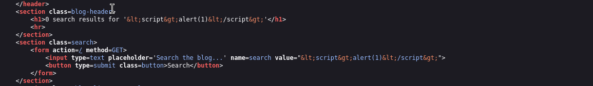
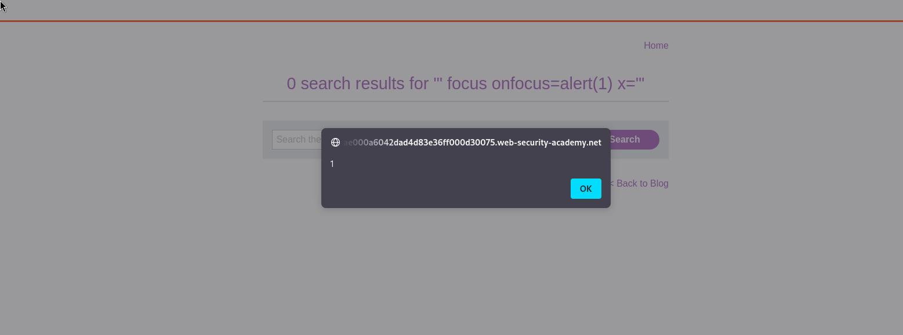

## Overview:
This is a simple lab to demonstrate the concept of reflected XSS into attribute with angle brackets HTML-encoded.
Target audience: apprentice

## Description:
This lab contains a reflected cross-site scripting vulnerability in the search blog functionality where angle brackets are HTML-encoded. To solve this lab, perform a cross-site scripting attack that injects an attribute and calls the alert function. 

## Methodology:
This lab is simple doesn't need any methodology. It is specific to a single vulnerability. 

## Execution:
Like always the search box is tested with the simplest payload `` to see how the 
application responds to it!

Then the source page is examined.

It is noticed that the passed payload is present two times in the source page!

One time in the **h1** tag and one time in the **value attribute of the input tag**!

Because the application filters angle brackets it is only possible to inject executable javascript code into the value attribute!

The following payload is suggested:
`" focus onfocus=alert(1) x="`

Explanation:
the first quote is to close the string of the value attribute,
the focus property is set to trigger the onfocus event which will execute the javascript code passed to it 
which is alert(1).
The x attribute is used to provide an opening quote for the closing quote of the string of the value attribute.

SOLVED!!!:

